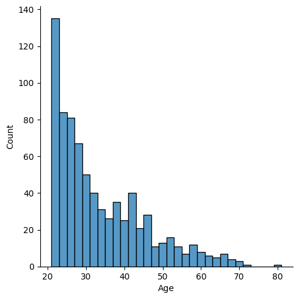

# Data Science & Analytics Portfolio List

  <h2>Projects</h2>
  <ul class="projects-list">
    <li>
      <a href="https://github.com/AngadKannaujiya/Logistics-Regression/blob/main/Pima%20Indian%20Diabetes.ipynb">Diabetes Class Prediction</a>
    <li>
      
Short description of Project 1.
    
        
    </li>
    <li>
      <a href="https://github.com/your-github-username/project-2">
    <li>
      
Short description of Project 2.

        
      </a>
    </li>
  </ul>

